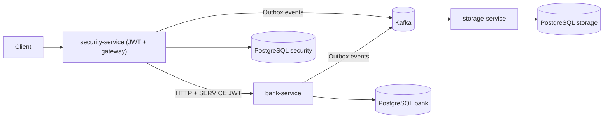

# BankApp: банковские сервисы

Пет-проект с небольшой банковской доменной моделью, разделенный на три сервиса
Spring Boot и событийную интеграцию через Kafka. Для bank-сервиса архитектура
построена по подходу Ports & Adapters: доменная логика и use-case сценарии
изолированы от HTTP, Kafka и persistence-слоя.

Сервисы:
- bank: основная доменная логика и операции со счетами.
- security: аутентификация/авторизация и gateway для клиентов.
- storage: потребление Kafka-событий и запись в БД.

## Модули
- `bank-domain`: доменная модель, доменные события и бизнес-правила.
- `bank-application`: сценарии, команды/запросы и application-сервисы.
- `bank-adapters`: web + Kafka адаптеры для банковского сервиса.
- `bank-bootstrap`: Spring Boot приложение банковского сервиса.
- `bank-contracts`: общие DTO и конверты/типы событий.
- `security`: сервис аутентификации, выпускает JWT и публикует user-события.
- `storage`: сервис хранения событий, читает Kafka и сохраняет в БД.

## Стек
- Java 20, Maven
- Spring Boot, Spring Security, Spring Data JPA
- Kafka
- PostgreSQL , Flyway

## Что демонстрирует проект
- Реализацию `bank` по схеме:
  `bank-domain` (бизнес-правила) -> `bank-application` (use cases + порты) ->
  `bank-adapters` (HTTP/Kafka/JPA адаптеры) -> `bank-bootstrap` (сборка приложения).
- Микросервисную интеграцию: security как входной контур, bank как доменный сервис, storage как сервис хранения событий.
- Асинхронное взаимодействие через Kafka с outbox-паттерном в `bank` и `security`.
- Безопасность на двух уровнях: пользовательские JWT и сервисные JWT (`SERVICE`) для внутренних вызовов.
- Etc: Flyway-миграции, контрактные DTO, модульные и интеграционные тесты.

## Как работает
- Клиенты работают через security, получают JWT и передают его в `Authorization: Bearer ...`.
- Security вызывает bank-сервис по HTTP с сервисным JWT (роль `SERVICE`).
- Bank и security публикуют события в Kafka через outbox.
- Storage читает Kafka-топики и складывает события в Postgres.

## Архитектурная схема


## Текущий статус и ограничения
- Outbox-паблишеры в `bank` и `security` ограничены по попыткам (`outbox.publisher.max-attempts`, по умолчанию `5`).
- При превышении лимита попыток событие переходит в статус `FAILED` и требует операционного разбора.
- Семантика доставки событий в интеграции — `at-least-once`, поэтому потребители должны быть готовы к дубликатам.

## Локальный запуск
1) Поднять инфраструктуру (Kafka + Postgres для всех сервисов):
```bash
docker compose up -d
```
Если раньше запускалась старая версия проекта и Flyway падает на `non-empty schema`, пересоздай тома:
```bash
docker compose down -v
docker compose up -d
```

2) Сгенерировать и экспортировать base64 секреты:
```bash
export JWT_SECRET=$(openssl rand -base64 32)
export JWT_SERVICE_SECRET=$(openssl rand -base64 32)
```
Для `./start-local.sh` это необязательно: если переменные не заданы, скрипт сгенерирует временные значения сам.

3) Быстрый запуск одной командой:
```bash
./start-local.sh
```
Скрипт автоматически останавливает ранее запущенные локальные инстансы `bank/security/storage` и ждет полного старта всех трех сервисов.
Опции:
- `./start-local.sh --reset-db` — пересоздать docker volumes перед запуском.
- `./start-local.sh --skip-docker` — запускать только приложения (без `docker compose`).

4) Либо запуск вручную (каждый сервис в отдельном терминале):
```bash
./mvnw -pl security -am spring-boot:run
./mvnw -pl bank-bootstrap -am spring-boot:run
./mvnw -pl storage -am spring-boot:run
```

## Порты по умолчанию
- Bank service: `http://localhost:8080`
- Security service: `http://localhost:8082`
- Storage service: `http://localhost:9093`
- Kafka: `localhost:9092`
- Postgres: bank `localhost:5433`, security `localhost:5434`, storage `localhost:5435`

## Настройки
- Все сервисы по умолчанию используют Postgres из `docker-compose.yml`.
- Kafka топики по умолчанию:
  - user: `client-topic`
  - account: `account-topic`
  - transaction: `transaction-created-topic`
- OpenAPI спецификация bank API:
  - `bank-bootstrap/src/main/resources/openapi/bank-openapi.yaml`
- Полные конфиги: `bank-bootstrap/src/main/resources/application.properties`,
  `security/src/main/resources/application.properties`,
  `storage/src/main/resources/application.properties`.

## Переменные окружения
Обязательные:
- `JWT_SECRET`: base64 секрет для пользовательских JWT (security).
- `JWT_SERVICE_SECRET`: base64 секрет для сервисных JWT (security + bank).

Часто используемые (есть дефолты в `application.properties`):
- `KAFKA_BOOTSTRAP_SERVERS`
- `BANK_BASE_URL`
- `BANK_DB_URL`, `BANK_DB_USER`, `BANK_DB_PASSWORD`
- `SECURITY_DB_URL`, `SECURITY_DB_USER`, `SECURITY_DB_PASSWORD`
- `STORAGE_DB_URL`, `STORAGE_DB_USER`, `STORAGE_DB_PASSWORD`
- `KAFKA_TOPIC_USER`, `KAFKA_TOPIC_ACCOUNT`, `KAFKA_TOPIC_TRANSACTION`
- `JWT_SERVICE_ISSUER`, `JWT_SERVICE_AUDIENCE`, `JWT_SERVICE_SUBJECT`, `JWT_SERVICE_ALLOWED_SUBJECTS`

Доп. настройки для Kafka consumers, outbox и cleanup — см. `application.properties` сервисов.

## Аутентификация и роли
- `POST /users/register` регистрирует пользователя только с ролью `CLIENT` (роль не задается снаружи).
- `POST /login` принимает `{ "username": "...", "password": "..." }` и возвращает JWT.
- JWT передается в `Authorization: Bearer <token>`.
- Роли:
  - `CLIENT`: доступ к `/users/me/**` и операциям со своими счетами.
  - `ADMIN`: доступ к `/users/**` и `/accounts/**` в security.
  - `SERVICE`: доступ к bank API (внутренние вызовы).

## API
- Bank API: `http://localhost:8080/swagger-ui/index.html` и `http://localhost:8080/v3/api-docs`.
- Security API: `/login`, `/logout`, `/users/**`, `/users/me/**`, `/accounts/**`.
- Web UI (security): `http://localhost:8082/ui/index.html` (путь `/` в security делает redirect на UI).
- Storage API не публичный (только Kafka consumer).

## Пример сценария
1) Регистрация:
```bash
curl -i -X POST http://localhost:8082/users/register \
  -H "Content-Type: application/json" \
  -d '{"login":"user1","password":"pass","name":"User","sex":"MALE","hairColor":"BLACK","age":20}'
```
Ожидаемо: `HTTP/1.1 200`.

2) Логин:
```bash
TOKEN=$(curl -s http://localhost:8082/login \
  -H "Content-Type: application/json" \
  -d '{"username":"user1","password":"pass"}')
echo "$TOKEN"
```
Ожидаемо: непустой JWT в формате `xxx.yyy.zzz`.

3) Авторизованный запрос:
```bash
curl -i http://localhost:8082/users/me \
  -H "Authorization: Bearer ${TOKEN}"
```
Ожидаемо: `HTTP/1.1 200` и JSON с данными пользователя.

## Тесты
Проект покрыт unit, integration и contract-тестами.

Тестовый стек:
- JUnit 5
- Mockito
- AssertJ
- Spring Boot Test (`@SpringBootTest`, `MockMvc`)
- MockWebServer (контрактные/интеграционные тесты `security`)
- Spring Kafka Test + `@EmbeddedKafka` (интеграционные тесты `storage`)
- H2 in-memory DB

Текущий набор:
- `bank-application`: unit-тесты use-case сервисов (`CreateUser`, `CreateAccount`, `Deposit`, `Withdraw`, `Transfer`, `Add/RemoveFriend`, `ImportUser`) и сериализации событий.
- `bank-bootstrap`: интеграционный `BankServiceApplicationTest` (`@SpringBootTest` + `MockMvc`) для ключевых HTTP-сценариев и ошибок валидации/домена.
- `security`: unit-тесты сервисов, contract-тесты web-клиентов, OpenAPI-контрактный тест (`BankOpenApiContractTest`) и интеграционный `SecurityIntegrationTest` (регистрация/логин/`/users/me`/logout).
- `storage`: unit/contract-тесты ingestion-слоя и интеграционный `KafkaConsumerIntegrationTest` (`@EmbeddedKafka`) с проверкой записи событий в БД.

Как запускать:
```bash
./mvnw test
```

```bash
# по модулям
./mvnw -pl bank-application test
./mvnw -pl bank-bootstrap -am test
./mvnw -pl security test
./mvnw -pl storage test
```

```bash
# конкретный тестовый класс
./mvnw -pl security -Dtest=SecurityIntegrationTest test
```

Тестовое окружение:
- Для тестов не нужен `docker compose`: используются in-memory БД (H2), `MockWebServer` и `EmbeddedKafka`.
- Flyway-миграции проверяются в интеграционных тестах (`bank-bootstrap`, `storage`).

## Сборка
```bash
./mvnw -DskipTests clean package
```
